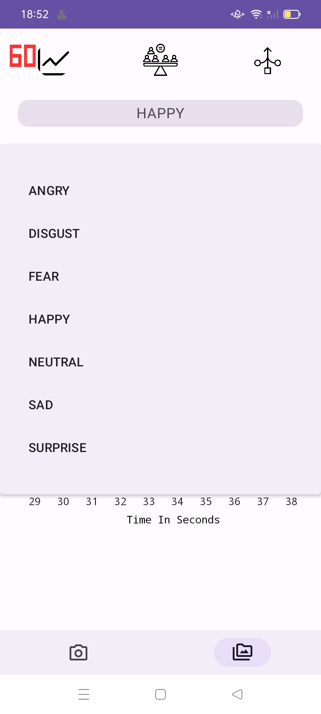
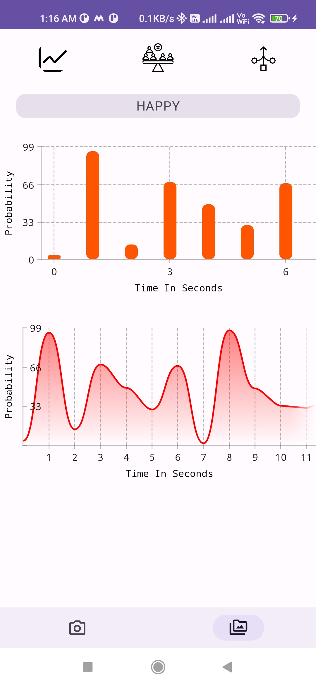
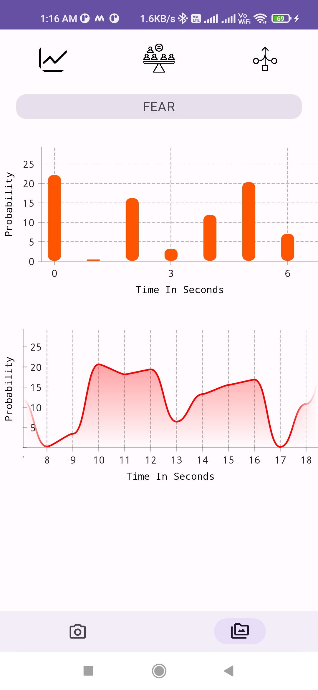
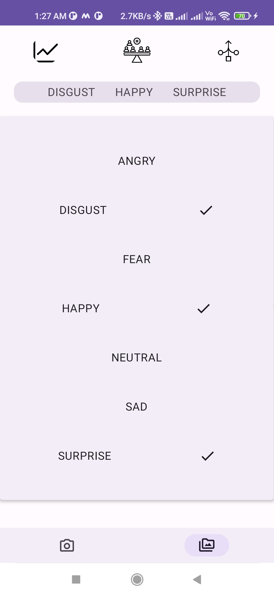
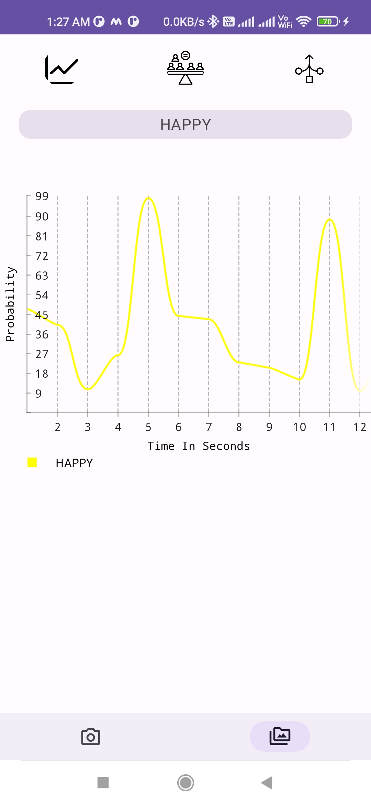
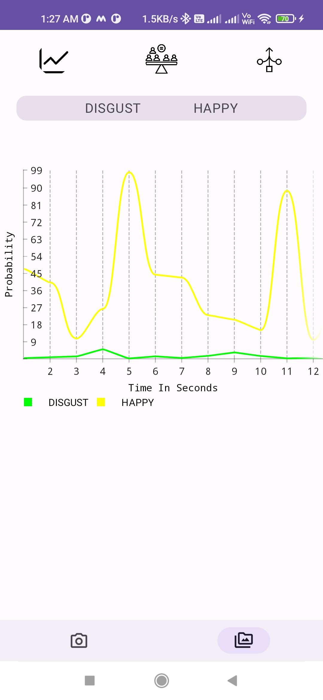
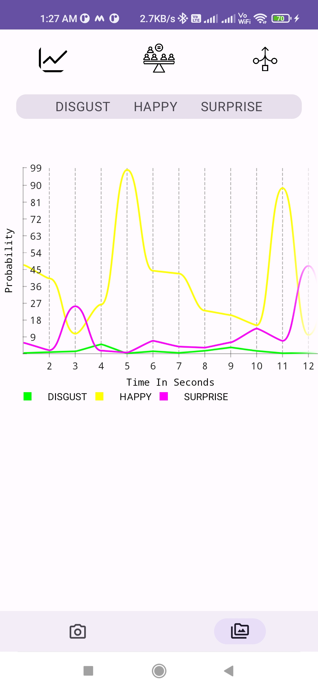
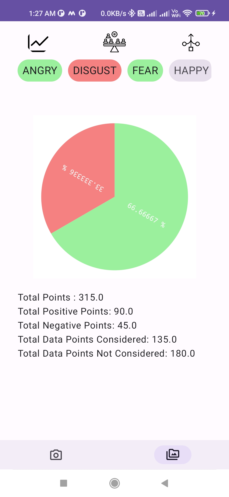

<h1>Capturing Video</h1>

 
  &nbsp;&nbsp;&nbsp;&nbsp;
   
  &nbsp;&nbsp;&nbsp;&nbsp;

 

  <h1>Single Emotion Wise Data Representation</h1>

   
    &nbsp;&nbsp;&nbsp;&nbsp;
   
    &nbsp;&nbsp;&nbsp;&nbsp;
   
     &nbsp;&nbsp;&nbsp;&nbsp;
   

 

  <h1>Compare Multiple Emotion Data</h1>

   
    &nbsp;&nbsp;&nbsp;&nbsp;
   
    &nbsp;&nbsp;&nbsp;&nbsp;
   
    &nbsp;&nbsp;&nbsp;&nbsp;
   

 

  <h1>Aggregate Multiple Emotion Data Into Probability</h1>

   
    &nbsp;&nbsp;&nbsp;&nbsp;
   

