# Real-Time Facial Emotion Feedback App

An Android application designed to capture and analyze facial expressions in real-time to provide emotional feedback. This tool is ideal for observing customer interactions and visualizing emotional data through intuitive charts and graphs.

## 📺 Project Demo
[Watch the Demo Video](https://drive.google.com/file/d/1vWR4a_TauCukLDYATxG3VPDyDkD2omIm/view?usp=sharing)

---

## 🚀 Features

### 1. Real-Time Video Capture
Capture video of users while they interact with products or services. The app utilizes CameraX and ML Kit to detect faces and analyze emotions on the fly.

| Capture Video  | 
|:---:|
| 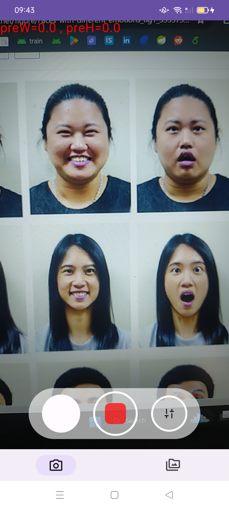  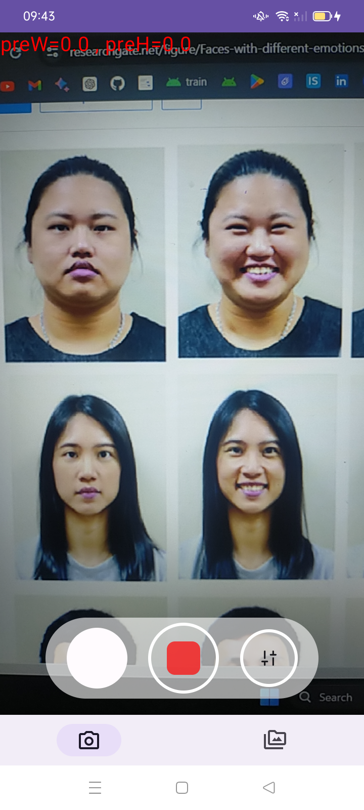 |

### 2. Single Emotion Analysis
Detailed representation of data for a specific emotion. Choose an emotion to see its frequency and intensity over time.

| Select single emotion| Happy emotion|Fear emotion | Disgust emotion|
|---|---|---|---|
| 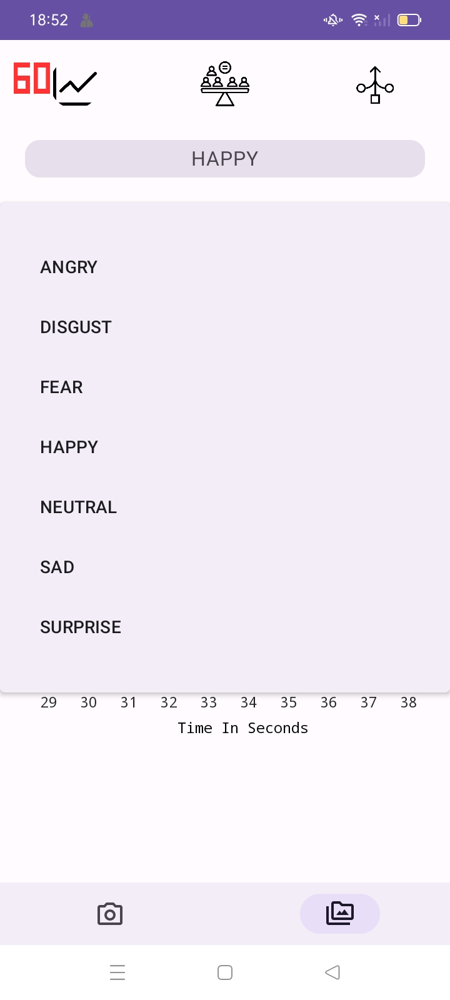 | 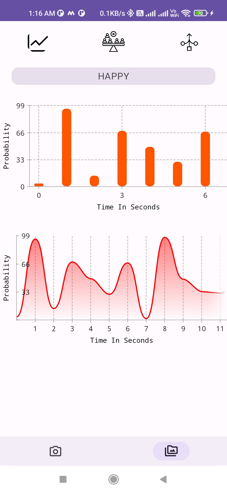 | 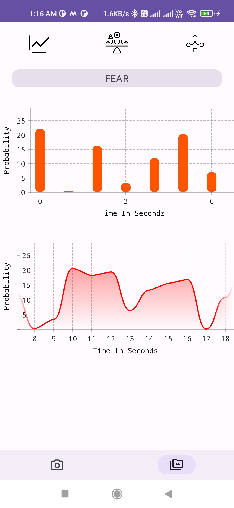 | 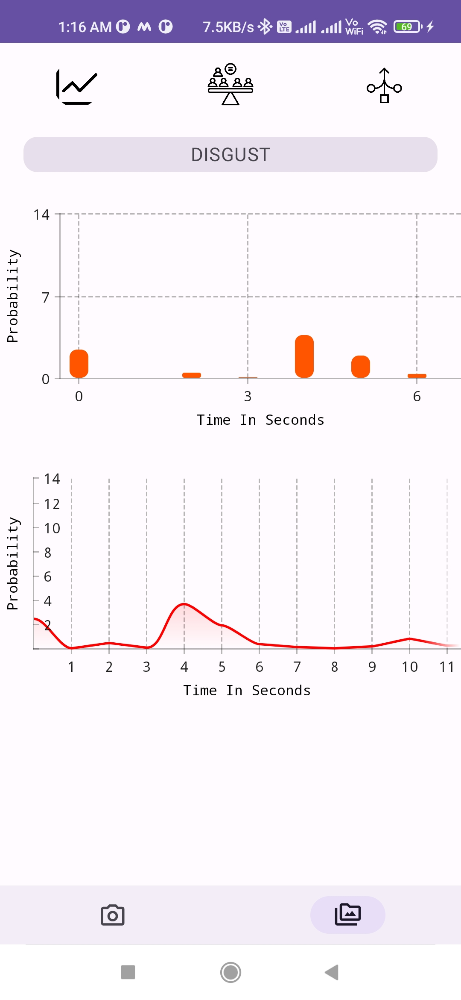 |

### 3. Emotion Comparison
Compare multiple emotions side-by-side to understand the transition and dominance of different facial expressions during an interaction.

| Select emotions from list| Happy emotion only|Disgust and Happy emotions |Disgust, Happy and Surprise emotions |
|---|---|---|---|
| 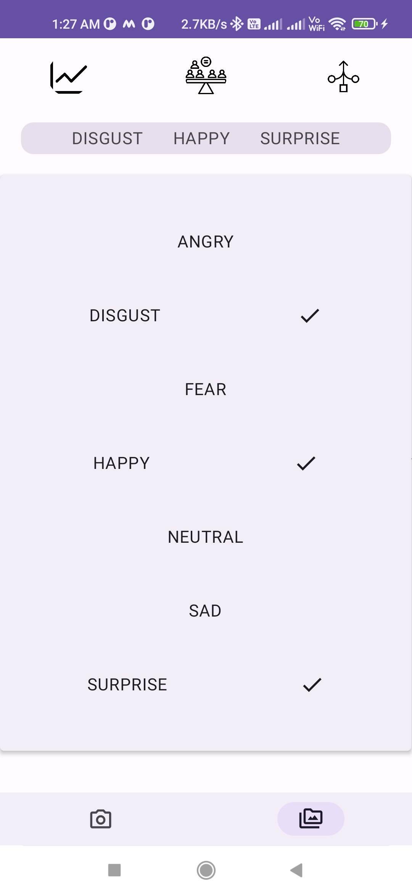 | 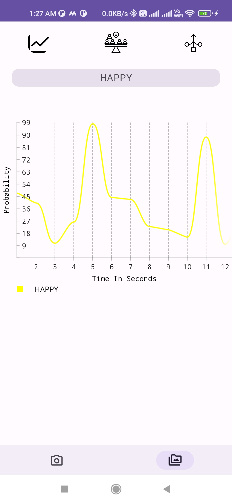 | 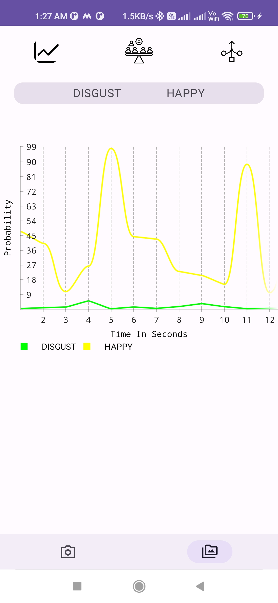 | 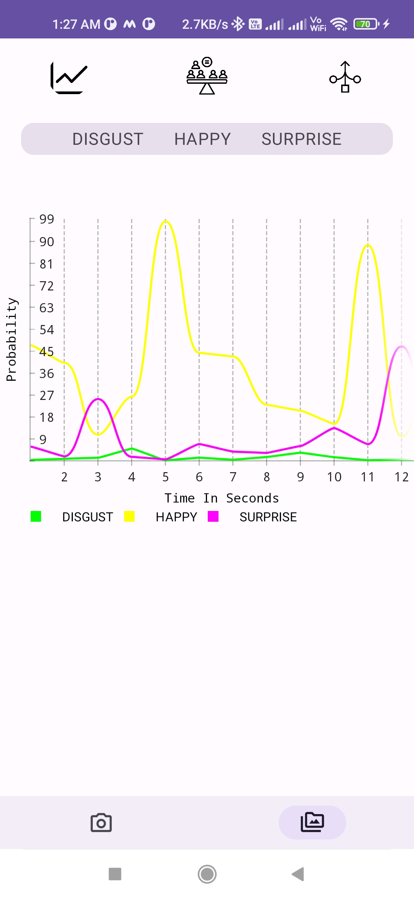 |

### 4. Aggregate Probability Data
Visualize the aggregate probability of all detected emotions to get an overall sentiment score.

| | |
|---|---|
| 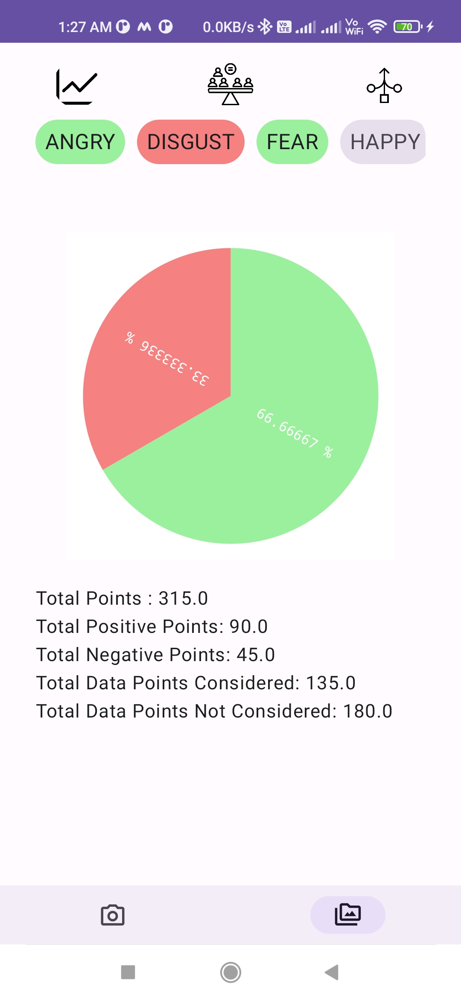 | 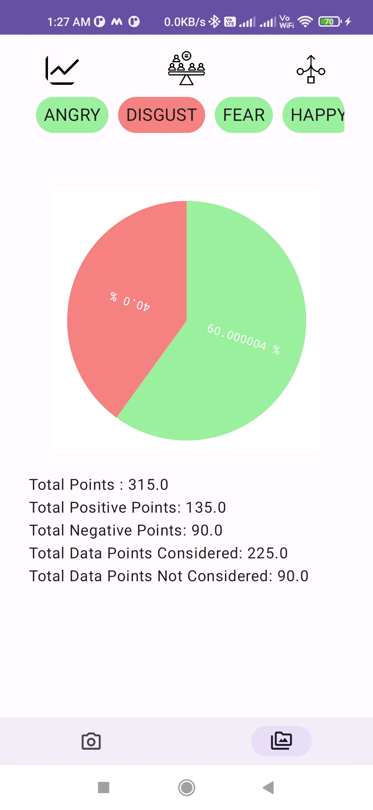 |

---

## 🛠 Tech Stack

- **UI:** Jetpack Compose
- **Camera:** CameraX
- **ML/AI:** 
    - Google ML Kit (Face Detection)
    - TensorFlow Lite (Emotion Classification)
- **Dependency Injection:** Dagger Hilt
- **Data Visualization:** 
    - Vico Charts
    - YCharts
- **Architecture:** MVVM (Model-View-ViewModel)

---

## ⚙️ Installation

1. Clone the repository.
2. Open the project in Android Studio (Iguana or newer recommended).
3. Build and run the app on an Android device (API 27+).

---
